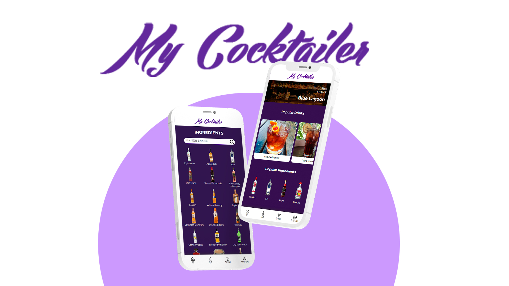

# My Cocktailer 

칵테일 API를 사용하여 칵테일 레시피 및 음료 정보를 제공하고 랜덤으로 추천 칵테일을 받을 수 있는 앱



## 배포 주소 
> [MyCocktailer 보러가기](https://mkhong210.github.io/mycocktailer/)

## Stack 
react / javascript / sass / github / visual studio code

## 개발 기간 
> 2023.10 / 3주간

## 사용 API 
- 칵테일 OPEN API [보러가기](https://www.thecocktaildb.com/)

## 주요 기능
- 

## 시작 가이드
Frontend
```
$ cd mycocktailer
$ npm install 
$ npm start
```